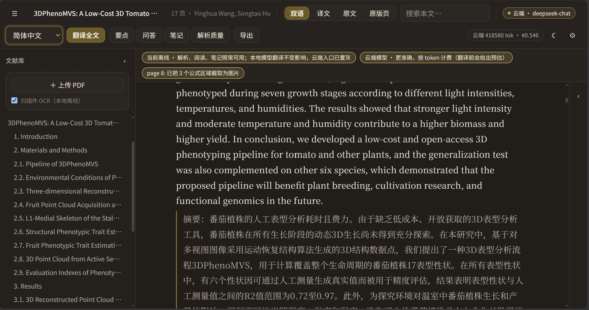
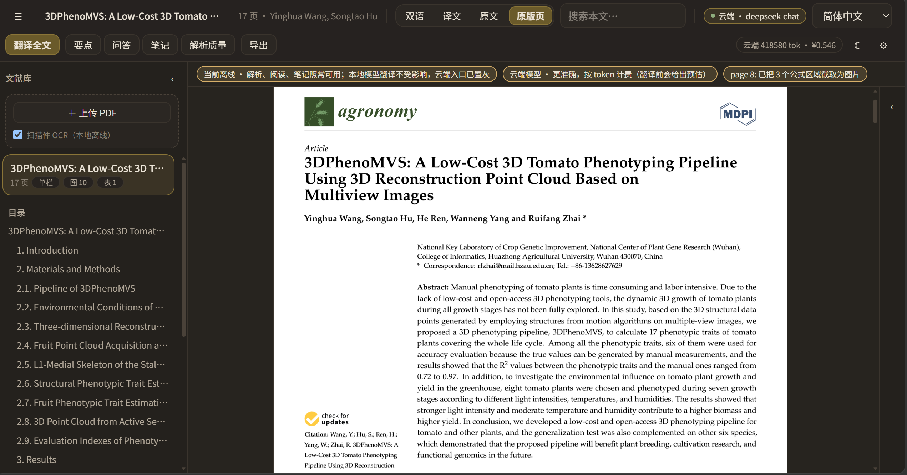
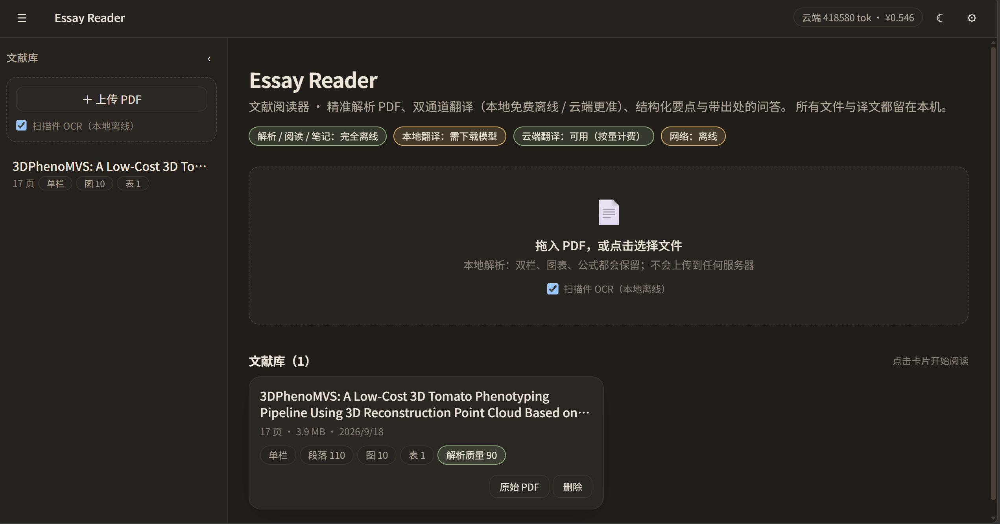
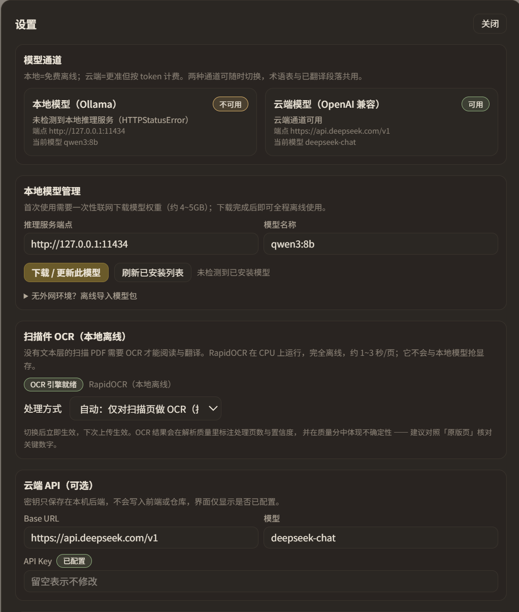

[English](README.md) | **简体中文**

# Essay Reader · 文献阅读器

本地优先的学术文献阅读工具：上传 PDF → 精准解析 → 双通道翻译（本地免费离线 / 云端更准）→ 结构化要点 → 带出处的问答。

界面为米白 + 淡黄的低干扰阅读风格；文献、译文、笔记全部留在本机，**除首次下载本地模型权重与可选的云端调用外，运行期不产生任何外部网络请求，也不采集任何使用数据**。

## 界面截图

**阅读视图** —— 左栏原文、下方内联译文；顶栏显示当前通道、用量与累计花费。界面提供米白（亮色）与深色两套主题。



**原版页模式** —— 用 pdf.js 渲染真实页面并与目录并排；选中段落会在页面上高亮对应区域，是核对解析与图表位置最可靠的手段。



| 文献库 | 设置 |
| --- | --- |
|  |  |

---

## 快速开始

### 从 GitHub 克隆后

```powershell
git clone https://github.com/Leon-xieluo-hub/essay-reader.git
cd essay-reader
powershell -ExecutionPolicy Bypass -File .\scripts\setup.ps1   # 安装依赖并构建前端
```

### 第一次：安装依赖

```powershell
powershell -ExecutionPolicy Bypass -File .\scripts\setup.ps1
```

### 以后每次启动（任选一种）

- **双击根目录的「启动文献阅读器.cmd」**（推荐，最简单）
- 或在终端：`powershell -ExecutionPolicy Bypass -File .\start.ps1`

启动器会自动处理这些事：构建缺失的前端、**清理占用端口的旧实例**、载入 `.env`、等服务就绪后打开浏览器，并在窗口里打印地址。**关闭那个窗口即停止服务。**

打开 <http://127.0.0.1:8787>，把 PDF 拖进左侧的虚线框即可。

> 服务不会开机自启、也不常驻后台：要用的时候运行一次启动器即可。本地工具没必要留常驻进程。
>
> 排查思路：打不开先看启动器窗口里打印的地址；如果窗口一闪而过，多半是端口被占（启动器会自动清理）或依赖缺失，把窗口里的报错发出来即可。
>
> 给维护者：`start.ps1` / `scripts\*.ps1` 必须保存为 **UTF-8 with BOM**。Windows PowerShell 5.1 在无 BOM 时按 ANSI 解码，中文注释会被解成乱码并导致语法错误（这个坑已经踩过一次）。

开发模式（前端热更新）：`start.ps1 -Dev`，另开一个终端 `cd frontend; npm run dev`，访问 <http://127.0.0.1:5173>。

### 手动安装（如果不想用脚本）

```powershell
# 后端依赖
python -m pip install --index-url https://pypi.org/simple fastapi "uvicorn[standard]" pymupdf python-multipart

# 前端构建
cd frontend; npm install; npm run build; cd ..

# 启动
$env:PYTHONPATH = "$PWD\backend"
python -m uvicorn app.main:app --host 127.0.0.1 --port 8787
```

> 若 pip 报 `Could not find a version that satisfies the requirement ... (from versions: none)`，
> 说明本机 pip 配置的镜像不可用，用 `-i https://pypi.org/simple` 指定官方源即可。

---

## 双通道与场景分工

| 场景 | 推荐通道 | 说明 |
| --- | --- | --- |
| 整篇翻译、日常批量阅读 | **本地模型** | 零 token、零费用、数据不出本机；长难句与术语建议复核（可疑段落会被标出） |
| 重要文献精读、总结、追问 | **云端模型** | 更准确更快，按 token 计费；翻译前给出预估费用，可设单篇预算上限 |
| 只读不译 | **关闭 AI** | 纯阅读模式：解析、阅读、搜索、笔记、图表全部可用，零网络 |

两种通道共用同一套**术语表**与**段落级缓存**，随时切换不丢工作；已在另一通道翻译过的段落会直接复用。
断网时云端入口自动置灰并说明原因，**不会静默降级**（避免你在不知情下拿到质量更低的译文）。

### 启用本地模型（一次性，之后永久离线）

1. 安装 [Ollama](https://ollama.com/download)（Windows 一键安装包）。
2. 打开应用 → 设置 → 「本地模型管理」→ 填写模型名（默认 `qwen3:8b`）→ **下载 / 更新此模型**，应用内会显示进度（约 4~5 GB，仅此一次需要联网）。
3. 顶栏通道菜单切到「本地模型」。

无外网环境：在能联网的机器上执行 `ollama pull qwen3:8b`，把 `%USERPROFILE%\.ollama\models` 整体拷贝到目标机器同一路径即可。

**显存建议**：8 GB 显存推荐 8B 级 + Q5/Q6 量化。宁可小模型高精度量化，也不要大模型激进量化 —— 量化对术语与数字保真的伤害大于参数规模的差异。

### 启用云端模型

设置 → 云端 API：填 Base URL、模型名、API Key（兼容任何 OpenAI 格式端点，如 DeepSeek / OpenAI / 自建中转）。
密钥只保存在本机后端，界面只显示「是否已配置」，不会回显。

> **配置会持久化**：保存后写入本机 SQLite（`settings` 表），重启应用时自动重新加载，
> 所以云端 Key / 模型名 / 并发等不会因重启丢失。保存时留空**不会**覆盖已存的密钥。
> 可用 `GET /api/settings/stored` 查看哪些项已落库（不返回密钥值）。

---

## 三大难点的处理方式

### 1. PDF 难以解析

- **双栏识别**：不靠"猜空白带"，而是找**第二块文本的重复行首**（既覆盖经典双栏，也覆盖 MDPI/Frontiers 那种"窄侧栏 + 正文"的版式），跨栏的大标题、宽表格因为只统计行首而不影响判定。检测到窄栏（宽度 < 正文栏 62%）时，栏内内容一律归入 `meta` —— 页边文章信息栏、引文信息、参考文献行号都属于这类。
- **文章信息（article info）单独成区**：`Citation:` / `Received:` / `Keywords:` / `Academic Editor:` 这类出版商标注被识别为独立的 `meta` 类型，**不进入正文流**：阅读区把它汇总成正文上方的一块「文章信息」，翻译、总结、搜索都不会把它当正文处理。当元信息栏与正文栏在水平方向交错、导致某个碎片被粘进正文句子时（例如 `…cultivation research, and Yang, W.; Zhai, R. 3DPhenoMVS: A`），后处理会把它拆出来单独成块。
- **期刊名不再穿插正文**：MDPI 等出版商会把 "Agronomy 2022, 12, 1865" 重复印在页面中部，位置规则抓不到；改用"同一文本重复 ≥3 次 + 字号不大于正文"判定，统一标记为页眉并移出正文流。
- **无框线表格还原**：很多期刊表格只有上下两条横线、没有竖线，PyMuPDF 的表格检测完全抓不到（本文档全篇 0 个表格）。兜底方案是把同一基线上的多个文本片段合并成行、按 12pt 以上的列间隙切单元格，再要求列位置在多数行上对齐；同时用"公式/参考文献"特征否决误判（否则公式和参考文献列表会被当成表格）。**左格折行的行**（右格缩写夹在两条基线之间，基线分组看不到成对的行，整行会被丢掉）会被显式吸收进来。实测该文档两列表格由 17 行 → **18 行**（表头 + 17 个性状，含 `FSI`），且翻译后保持行列对应（表头 → `性状/缩写`，缩写 `PH`/`PW` 保持原样）。
- **公式按原版面截取**：PDF 文本层返回的公式是**乱序**的——上下标、大括号、求和限会各自成为独立行（`\x1a \x1b b∈B ∥a −b ∥ h(A, B) = max min`），任何文本后处理都无法可靠还原。因此改为以**公式编号 `(n)` 为锚点**按区域整块截取为图片：编号所在基线附近的片段即该公式内容（含 `z` / `ph` / `V =` 这类纯字形片段），相邻公式各成一张图、不会连在一张里；截取时取该行完整水平范围，避免左端被切掉。**正文永不被裁进图片**：只是恰好同处一带的句子会被排除出裁图矩形、留在正文流里；只提到算式的段落（`…R² = 0.72…`）也不会被改判为公式，字体不变、照常参与翻译。公式在正文原位内联显示、点击可放大，同时保留原始文本用于搜索；实测 4 张公式图（含 MAPE 求和公式）全部完整。
- **目录净化**：跑头（`5 of 17`）、测量值（`0.72 to 0.97`）、日期元数据、图注、符号碎片一律不进目录；跨行大标题合并为一条 L1；品牌碎词（`agronomy` / `Heliyon` / `Winter`）通过字号层级与"编号章节优先"规则剔除 —— 有编号章节的论文，目录只保留编号章节 + 标题；编号列表项因字号明显小于真标题也会被剔除；**数字开头的章节**（`2.8. 3D Point Cloud from Active Sensors`）以及**被粘在后续句子前的标题**都能正确进入目录。
- **扫描件 OCR 兜底**：没有文本层（或正文极少但整页被栅格图覆盖）的页面自动转走 **RapidOCR（ONNX，CPU，完全离线）**，识别结果按行并入同一套版面逻辑（栏检测、段落合并、标题判定），因此扫描件也能翻译与总结。OCR 页数、平均置信度会写进解析自检，并在质量分中扣减 —— 不会把识别结果伪装成干净的文本层。上传界面上有开关，设置里可选 `自动 / 强制 / 关闭`。
- **表格先剥离**：先用 `page.find_tables()` 找出表格区域，把落在区域内的文本行从正文流中剔除，避免表格单元格被当成正文、甚至凭空造出"第二栏"；表格本身还原为结构化行列 + HTML，界面里可横向滚动，也可切「原版页」对照。同一步还会否决"假表格"——若候选区域里的文本是满宽成行的（例如参考文献区），就不当作表格。**表格只能吞掉它自己还原出来的内容**：会比对「被剔除行的字符数」与「重建单元格的字符数」，覆盖不足 80% 就把原始文本留在正文里并写入告警，而不是让它凭空消失。
- **阅读顺序**：整行块先成段，然后按「栏号 → y」排序，保证左栏读完再读右栏，而不是逐行左右横跳。**非正文块（文章信息 / 页眉 / 期刊名）被统一提到正文之前**，正文中间不再穿插元信息或刊名。
- **被排版切断的段落会接回**：分页切断、或被浮动图表打断的段落会重新合并。判据是排版性的而非风格性的——段落最后一行**顶到栏右边界**说明被版心截断、必然还有下文；这条规则对 MDPI / Frontiers / Elsevier 那种「块状分段、不缩进」的排版同样成立（实测 9 篇论文里首行缩进比例只有 1%~13%，靠缩进判不出来）。以下情况不合并：下一个块是章节标题、行内标题（`Stem length:`）、图注，或两块之间夹着表格/公式；跨页时只有「顶满版心 + 下一页以小写字母续接」同时成立，才允许跨过浮动图表合并。
- **行内样式保留**：加粗/斜体按 span 提取为 `emphasis` 区间（记录的是块文本里的字符偏移），在阅读区渲染为 `<strong>` / `<em>`，并与搜索高亮叠加显示。
- **图表裁切**：按 bbox 以 200 DPI 渲染裁切为 PNG，自动绑定最近的图注（caption），点击可放大；过小的图片（logo、横线、印章）按面积比过滤。
- **段落与标题修复**：断行连字符（`hyphen-\nation`）自动接合；页眉页脚与页码识别为独立类型、不参与翻译；被粘进正文的标题行会在行边界处拆回标题；嵌在正文段落中间的元信息行也会被拆出（而不是把整段误判成元信息）。
- **解析自检**：输出文本覆盖率、乱码率、段落数、图表数、版面判定与耗时，在侧栏「解析质量」里如实展示，并给出质量分。解析结果按文件 SHA-256 缓存，同一文件不会重复解析。

### 2. 翻译容易出错

- **占位符保护**：翻译前把公式、引用 `[12]`、DOI、URL、图号 `Fig. 3`、**日期**（`1 February 2020` / `2020-06-29`）与数字等替换为 `<ph id="n"/>`，翻译后精确回填；丢失的占位符会补回原文并记录告警。日期必须整体保护：模型被要求翻译 `1 February 2020` 时会稳定地写出「1 年 2020 月」。`3D` / `2D` 这类「数字+字母」短标记也作为一个整体保护（只遮数字会把它切成 `<ph id="0"/>D`，模型一旦挪动标签就会在中文里留下孤立的 `3`），而 `3DPhenoMVS` 这种词内数字则不遮，保证专有名词完整。
- **只翻译有内容的块**：遮掉受保护片段后若不再剩任何字母/汉字，该块直接跳过（编号列表 `5. 6. 7. …`、纯链接行、公式块）。此前这类块会被送去翻译，产出「5。6。7。」这种无意义结果并白花 token。
- **术语表**：自动抽取术语并统一译法，翻译时强制注入；可在界面增删改，改完对新翻译立即生效。
- **上下文感知分块**：按 token 预算切块，切点落在段落边界，每块携带文档标题、术语表与前文若干段，降低指代错误。
- **质量校验回路**：逐段检查占位符与引用数量、数字是否丢失、译文字数比例（漏译/扩写）、是否真的译成了目标语言；不合格自动重译一次并附上失败原因，仍不合格则标记为「待复核」，在正文左侧显示黄色标记，并提供一键用云端重译该段。长度比阈值按中文压缩率校准（技术中文约为英文的 25–40%），过紧会把正确译文全部误标。
- **表格按网格翻译**：表格不作为正文参与分块，而是整表以 JSON 行列发给模型，并要求返回**完全相同的行列数**——行列错位会让数据张冠李戴，所以形状不符直接判失败。单元格同样走占位符保护，数字与缩写保持原样。
- **本地模型强制校验**：本地通道下质量校验不可关闭，因为小模型在数字与引用上的出错率明显更高。

### 3. 图片与表格难以呈现

- 图片原位内联显示、点击灯箱放大、图注随正文翻译；
- 表格保留行列结构（表头/表体区分、脚注保留），支持横向滚动，并可切「查看原图」核对；
- 公式可转 LaTeX 的用 KaTeX 渲染，不能转的保留原文并提示切「原版页」；
- 「原版页」模式用 pdf.js 渲染真实页面，选中段落会在页面上高亮对应区域 —— 这是核对解析与图表位置最可靠的手段。

### 4. 界面

- **界面语言跟随系统**：中文系统显示简体中文，其余显示英文；顶栏 `中 / EN` 可手动切换并记住选择（共 313 条界面文案，无缺失键）。
- **目录紧跟当前文献**：目录渲染在当前文献卡片下方（限高 42vh 可滚动），不再排在整份文献库之后 —— 文献一多就再也够不着。
- **切换双语/译文/原文保留阅读进度**：切换时把「视口顶部所在的段落」重新钉回顶部。三种模式会改变每个块的高度，浏览器钳制 scrollTop 后会看起来像跳回开头。
- 主题跟随系统（米白 / 深色）并可固定；字号可调且会被记住。

---

## 目录结构

```
backend/
  app/
    config.py            环境变量与运行时可调设置
    schemas.py           Document IR / API 契约（与前端 types.ts 一一对应）
    db.py                SQLite：documents/blocks/translations/glossary/notes/summaries/usage
    parsing/pdf_parser.py  PDF → IR：版面、阅读顺序、图表裁切、表格还原、解析自检
    providers/__init__.py  双通道抽象：Ollama(local) / OpenAI 兼容(cloud) / off
    services/protect.py    占位符保护与质量校验
    services/prompts.py    翻译/总结/术语/问答提示词模板（本地与云端两套约束）
    services/translate.py  翻译流水线（分块→保护→模型→修复→校验→缓存）
    services/summary.py    结构化要点 + BM25 检索的带出处问答
    main.py                FastAPI 路由 + 任务队列 + 本地推理串行锁 + SPA 托管
  tests/
    smoke.py               占位符/切分/JSON 容错单元测试
    test_parser.py         解析器回归测试（双栏 + 单栏 + 扫描件 + 真实论文）
    make_sample*.py        自动生成测试用 PDF（无版权内容；样本 PDF 不入库，跑测试时自动生成）
frontend/
  src/styles.css         设计 token（米白/淡黄/深灰褐，含夜间模式）
  src/store.ts           Zustand 状态与所有业务动作
  src/api/               类型化 API 客户端
  src/components/        TopBar / Sidebar / ReadingPane / BlockView / PdfPane / Dock / SettingsPanel …
  src/views/             Library（文献库）/ DocumentView
scripts/setup.ps1        首次安装依赖并构建（运行应用请用根目录的 start.ps1 / 启动文献阅读器.cmd）
.env.example             全部可配置项与说明
README.md / README.zh-CN.md   英文 / 中文说明（GitHub 首屏为英文版）
CHANGELOG.md / CHANGELOG.zh-CN.md   各版本更新说明
images/                  README 配图
```

数据目录 `backend/data/`（文献、译文、图表、SQLite）不入版本库，删除它等于清空文献库。

---

## 接口一览

| 方法 | 路径 | 说明 |
| --- | --- | --- |
| GET | `/api/health` `/api/environment` `/api/providers` | 健康检查、网络与通道状态 |
| GET/POST | `/api/documents` | 列出 / 上传解析（同文件哈希自动复用） |
| GET | `/api/documents/{id}` `/blocks` `/file` `/export` | 文档、块、原始 PDF、Markdown 导出 |
| DELETE | `/api/documents/{id}` | 删除文献及其译文、笔记、图表 |
| POST | `/api/translate` `/api/translate/estimate` | 启动翻译任务 / 预估 token 与费用 |
| POST/GET | `/api/summary` `/api/summary/{id}` | 生成 / 读取结构化要点 |
| POST | `/api/ask` | 带出处的问答（BM25 检索 + 引用 block id） |
| GET/POST/DELETE | `/api/notes` `/api/glossary` | 笔记与术语表 |
| GET/PUT | `/api/settings` `/api/usage` | 设置与用量（用量只统计，不上报） |
| POST | `/api/models/pull` | 应用内下载 Ollama 模型（SSE 进度） |
| GET | `/api/tasks/{id}` | 任务进度 |

交互式文档：启动后访问 `/docs`。

---

## 离线能力矩阵

| 功能 | 断网可用性 |
| --- | --- |
| 上传、解析、版面重建、图表裁切、表格还原 | ✅ 完全离线 |
| 扫描件 OCR（RapidOCR / ONNX，CPU） | ✅ 完全离线（模型随依赖安装，不联网下载） |
| 阅读、缩放、目录、搜索、阅读进度 | ✅ 完全离线 |
| 段落对齐、高亮笔记、Markdown 导出 | ✅ 完全离线 |
| 翻译 / 总结 / 问答（本地模型） | ✅ 需模型权重已下载（仅下载那一次联网） |
| 翻译 / 总结 / 问答（云端） | ❌ 需网络，不可用时置灰并说明原因 |
| 首次下载本地模型 | ❌ 唯一需要联网的环节（支持离线导入模型包） |

---

## 测试

```powershell
$env:PYTHONPATH = "$PWD\backend"
python backend\tests\smoke.py         # 占位符保护 / 切分 / JSON 容错
python backend\tests\test_parser.py   # 合成样本 + 真实论文的解析回归
```

`test_parser.py` 覆盖四组：双栏带图表表格、单栏论文体、扫描件 OCR、以及一篇**真实的 17 页 MDPI 论文**
（`backend/tests/samples/real_world_3dphenomvs.pdf`，仅作解析测试用）。前两组与扫描件由
`make_sample*.py` 自动生成，仓库不需要额外二进制样本。

测试全程只写临时目录（`ESSAY_DATA_DIR` 与合成样本都指向系统临时目录，退出时清理），
因此跑测试不会往 `backend/data`（你的文献库）或 `backend/tests/samples` 里留下任何文件。

> 仓库里唯一的二进制测试样本 `backend/tests/samples/real_world_3dphenomvs.pdf` 是 MDPI 期刊
> *Agronomy* 2022, 12, 1865 的开放获取论文（CC BY 4.0，作者 Yinghua Wang 等，DOI 见论文首页），
> 仅作为真实排版回归用例原样收录，未作任何修改；版权归原作者，按 CC BY 4.0 再分发。

真实论文那组断言的是曾经真实出过的问题（详见 `IMPROVEMENT_PROMPT.md`）：

- 第 5 页块数 ≤ 12（曾碎成 37 块、每行一块）、段落中位长度 ≥ 60 字符；
- 跨块句子完整（重新分块不丢字，全篇覆盖率 ≥ 99%）；
- 目录里没有 `N of M` 跑头（曾混入 16 条）、没有 `0.x` 测量值、没有品牌碎词（`agronomy` / `Winter` / `Heliyon`）；
- 目录包含 `1. Introduction` / `2. Materials and Methods` / `3. Results`；
- 前沿信息栏（`Citation:` / `Received:` / `Keywords:`）被识别为独立 `meta` 类型，不与正文混排；
- 页中重复的期刊名被移出正文流，引文栏碎片不再打断正文句子；
- 无框线（仅横线）的两列表格被还原为 17 行结构化数据；
- 乱序的显示公式被截取为图片而不是当作乱码文本；
- 数字开头的章节（`2.8. 3D Point Cloud…`）进入目录；
- 块 ID 全局唯一、每页都有块（曾因 ID 跨页重复而只入库最后一页）；
- **两段被并成一块**：首行缩进的行即使行距与正文完全相同也另起段落（早期只按行距断段，缩进的第一行会被吞进上一段）；
- **一段被分页拆成两块**：页末以残缺句收尾时，与下一页开头重新接回同一块（要求下一页首行非缩进、不是页眉、行宽足够），接续后不产生重复文本，全篇页末不再有断句残留。

已用真实文献验证过的解析结果（公开论文，只读复制、未改动原文件）：

| 文档 | 页数 | 版面 | 块数 / 覆盖页 | 图 | 表 | 目录条目 | meta |
| --- | --- | --- | --- | --- | --- | --- | --- |
| MDPI 番茄生长监测 | 21 | 单栏 | 307 / 21 | 13 | 0 | 25 | 10 |
| Frontiers 3D 数据增强 | 17 | 双栏 | 333 / 17 | 14 | 1 | 29 | 3 |
| Heliyon 产量估计 | 21 | 单栏 | 332 / 21 | 11 | 0 | 24 | 2 |
| MDPI 3DPhenoMVS | 17 | 单栏 | 181 / 17 | 6 | 1 | 25 | 17 |

> 表中的块数会随解析规则改进而变化；「MDPI 3DPhenoMVS」一行是**当前版本**的实测值
> （181 块 / 110 段，17 页，无框线表格还原为 17 行）。

前端类型检查与构建：

```powershell
cd frontend; npx tsc --noEmit; npm run build
```

---

## 已知限制

- OCR 是识别重建：标点、连字符与个别字符可能与原页面不一致（实测 200 DPI 下置信度约 0.98），关键数字请对照「原版页」核对。整页旋转/倾斜的扫描件未做纠偏，识别率会下降。
- 表格还原依赖 PyMuPDF 的表格检测；无框线的两列表格有专门兜底（按行分组 + 列对齐），但结构更复杂（合并单元格、嵌套表头）的无框线表格仍可能还原不全，建议切「原版页」对照。
- `pymupdf_layout` 未启用；版面判定为规则实现，对极端三栏或杂志式混排可能需要人工核对。
- 标题与目录净化是**规则 + 字号的启发式**：极端版式（例如刊名与标题同字号且紧邻）仍可能多出一条或漏掉一条目录项；发现后可在「解析质量」面板核对原始页面。OCR 页不提供字号信息，因此这些判据在扫描件上会退化为纯文本规则。
- 论文的**图标式期刊页眉**依赖 span 颜色识别（白字色带可识别，深绿等深色刊名依赖字号/规则判据）。PDF 若不提供颜色信息同样会退化。
- **公式是图片而非 LaTeX**：这样能保证显示与原版面一致且完全离线，但公式内容不参与翻译、也不能被全文搜索命中（原文本仍保留用于检索）。若要 LaTeX，需要接入公式识别模型（如 pix2tex），会带来额外依赖与耗时。
- 本地 8B 模型的中文语感与长难句处理弱于云端大模型，这是模型能力的差距；术语一致性与数字保真已由术语表 + 占位符 + 质量校验兜底。
- 首次本地翻译会先把模型加载进显存（约 10~30 秒），后续段落才会快起来。
- 成本预估是**校准过的近似值**（输入按 700 token/块开销、输出按 1.3 倍估算）。实测一篇 17 页论文：预估输入 27.3k / 输出 17.6k，实际输入 39.1k / 输出 17.5k，实际花费约 ¥0.08（`deepseek-chat` 定价）。
